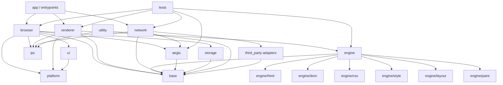
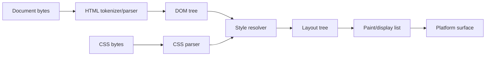

# Speed Module Boundary Map

Purpose: define major modules, ownership, allowed dependencies, and placement rules.

## 1. High-level module map

## 2. Module responsibilities

| Module          | Responsibility                                                                       | Must not own                                             |
| --------------- | ------------------------------------------------------------------------------------ | -------------------------------------------------------- |
| `base`          | Common utilities, logging primitives, result/status types, IDs, small containers     | Browser policy, network, UI, DOM                         |
| `platform`      | OS abstraction, windows, process launching, file primitives, event loop adapters     | Web engine logic, Aegis policy                           |
| `ipc`           | Schema definitions, serialization, transport abstractions, generated/manual bindings | Business logic, URL policy, rendering                    |
| `browser`       | Authority, tab model, navigation orchestration, permissions, process supervision     | HTML/CSS parsing, external network dispatch              |
| `ui`            | Browser chrome, address bar, tab strip, user actions                                 | Policy authority independent of Browser Process          |
| `renderer`      | Renderer process host code, document lifecycle, connection to engine                 | External network, profile storage                        |
| `engine`        | DOM/CSS/layout/paint pipeline                                                        | Browser permissions, process launching, external network |
| `engine/html`   | HTML tokenization/parser subset                                                      | Network, UI, storage                                     |
| `engine/dom`    | DOM tree representation                                                              | Browser permissions, external network                    |
| `engine/css`    | CSS tokenizer/parser subset                                                          | Network, UI, storage                                     |
| `engine/style`  | Selector matching, cascade, computed style                                           | Browser permissions, external network                    |
| `engine/layout` | Layout tree and geometry                                                             | Network, profile storage                                 |
| `engine/paint`  | Display list, paint commands, raster abstraction                                     | External network, profile storage                        |
| `network`       | Fetch service, HTTP/TLS wrappers, request lifecycle                                  | UI, DOM/layout, history                                  |
| `aegis`         | Blocking rules, classification, request policy result                                | Direct network I/O, UI enforcement                       |
| `storage`       | Profile, history, session persistence                                                | Rendering, parsing, external network                     |
| `utility`       | Future isolated task execution                                                       | Browser authority, direct profile ownership              |
| `third_party`   | Vendored or adapter entrypoints                                                      | Cross-cutting architecture decisions                     |

## 3. Engine pipeline boundaries

Rules:

- HTML parser produces DOM, not UI widgets.
- CSS parser produces stylesheet structures, not layout directly.
- Style resolver combines DOM and CSS.
- Layout consumes computed style and DOM-derived boxes.
- Paint consumes layout output.
- Platform surface is reached through an abstraction.

## 4. Aegis module boundary

Aegis owns:

- Rule representation.
- Rule parsing.
- Request classification.
- Decision result: allow/block/ignore with reason.
- Future extension points for cosmetic filtering and privacy policy.

Aegis does not own:

- Socket I/O.
- UI enforcement.
- Browser profile authority.
- Renderer DOM mutation in v0.1.

Allowed dependency direction:

- `network -> aegis` for request decisions.
- `browser -> aegis` for UI/debug state if needed.
- `aegis -> base` only, unless ADR allows more.

## 5. IPC module boundary

IPC owns structure, not policy.

Allowed:

- Message schema definitions.
- Serialization/deserialization.
- Transport abstraction.
- Generated C++ bindings.
- Message validation helpers.

Forbidden:

- Hardcoding navigation policy in IPC.
- Letting IPC call directly into engine modules.
- One-off serialization inside Browser/Renderer/Network modules.

## 6. Storage module boundary

Storage owns durable local data abstractions.

v0.1 storage:

- Profile root.
- History store.
- Optional session state.

Rules:

- Browser Process uses storage.
- Renderer Process does not link storage write APIs.
- Storage should not know about UI widgets.
- Storage schema changes later require migrations or explicit reset policy.

## 7. Placement checklist

Before adding a new file, answer:

1. Is this process-specific or engine-generic?
2. Does this code require authority?
3. Does it parse untrusted content?
4. Does it call external network?
5. Does it touch profile storage?
6. Which module owns the public interface?
7. Which tests should cover it?

If two modules need each other, introduce an interface in the lower-level or boundary module rather than creating a cycle.
