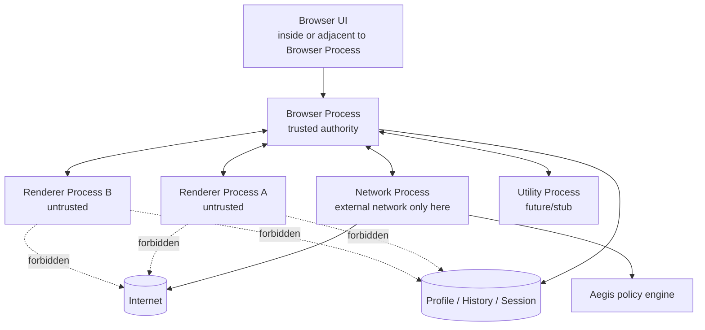
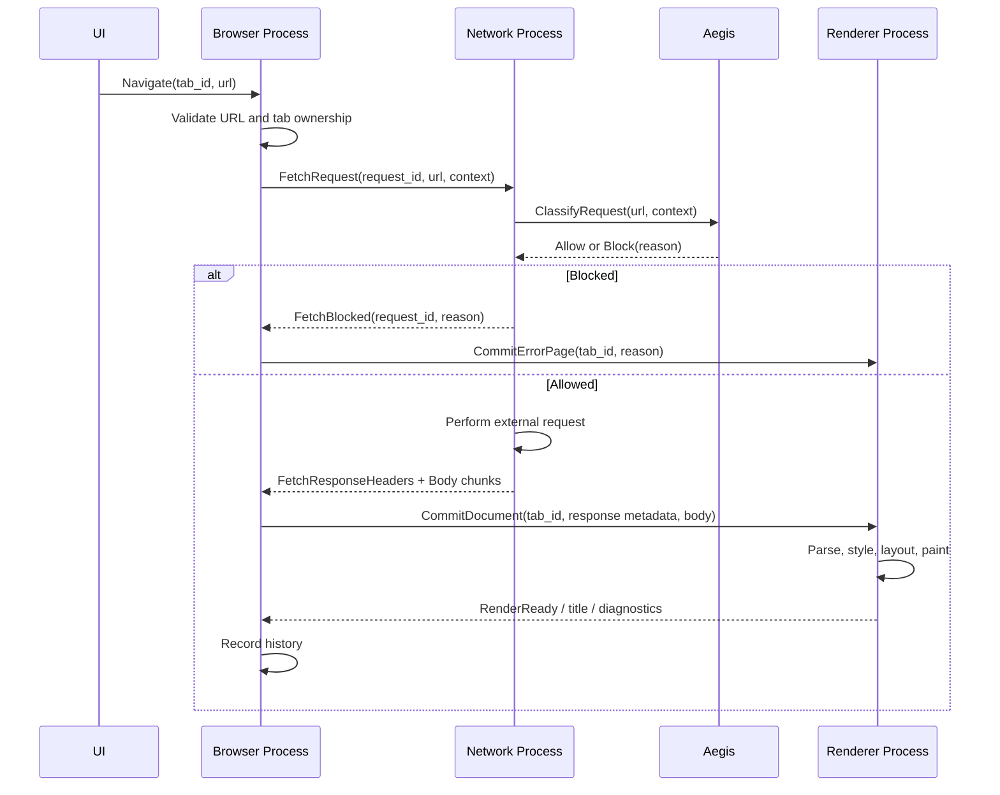

# Speed Process & Security Boundary Map

Purpose: define process ownership, trust levels, and allowed communication paths.

## 1. Process types

| Process          |               Trust level | Main responsibilities                                                                                              | Forbidden responsibilities                                                                                           |
| ---------------- | ------------------------: | ------------------------------------------------------------------------------------------------------------------ | -------------------------------------------------------------------------------------------------------------------- |
| Browser Process  |         Trusted authority | UI orchestration, tab lifecycle, permissions, profile, session, history, process supervision, navigation authority | Parsing untrusted complex content as a normal operation; external network fetches directly in long-term architecture |
| Renderer Process |                 Untrusted | DOM/CSS/layout/paint for assigned document, input event interpretation within document, generating render output   | External network, profile storage, permission authority, process spawning, arbitrary filesystem access               |
| Network Process  | Partially trusted service | External HTTP/HTTPS fetch, request policy enforcement with Aegis, response metadata, network errors                | UI authority, direct DOM/layout, profile-wide permission decisions                                                   |
| Utility Process  |     Task-specific sandbox | Future image/font/PDF/JS/media parsing and other dangerous work                                                    | Long-lived authority, profile ownership, direct UI authority                                                         |

## 2. v0.1 process topology

Current implementation note: app startup defaults to in-process wiring for stability, while
`speed-browser --process-model=multi-process` and
`speed-browser-gui --process-model=multi-process` exercise the real-process v0.1 path. The opt-in
path launches a Network Process and one Renderer Process per tab as needed, connected by
schema-defined framed IPC.

## 3. Browser Process authority

The Browser Process owns:

- Process registry.
- Tab registry.
- Top-level navigation lifecycle.
- Permission decisions.
- Profile path and profile state.
- History write authority.
- Session restore coordination.
- Child process crash detection.
- Policy decisions that require user or profile context.

The Browser Process may delegate work, but not authority.

## 4. Renderer Process rules

Renderer Process rules are Fixed:

- Treat all input as untrusted.
- Do not open external sockets.
- Do not read or write profile files.
- Do not make final permission decisions.
- Do not persist browsing history.
- Do not own global browser state.
- Communicate only through approved IPC messages.
- Assume the Browser Process may terminate the renderer at any time.
- Validate all IPC input despite Browser Process authority, because bugs happen.

## 5. Network Process rules

The Network Process:

- Is the only external network path.
- Must consult Aegis before dispatching a request.
- Must return structured response metadata.
- Must not directly mutate DOM or UI.
- Must not directly write browser history.
- Must not silently retry blocked requests through alternate paths.
- Must expose enough diagnostics for blocked, failed, and successful requests.

## 6. Utility Process rules

Utility Processes are not required in production for all v0.1 features, but the architecture must support them.

Future candidates:

- Image decoding.
- Font parsing.
- PDF parsing/rendering.
- JavaScript engine execution.
- Media demux/decode.
- Archive/decompression of complex formats.

Rules:

- Utility Processes receive narrow tasks.
- They return results through schema-defined IPC.
- They do not own browser profile state.
- They are disposable and restartable.

## 7. Navigation flow v0.1

## 8. IPC categories

Initial IPC categories:

- Process lifecycle.
- Tab lifecycle.
- Navigation.
- Network request/response.
- Renderer document commit.
- Renderer status/crash.
- Aegis diagnostics.
- Test control messages.

Every category must have schema ownership under `src/ipc/schemas/` or equivalent.

## 9. Process isolation evolution

v0.1 Strong Default:

- At least one Renderer Process per tab/browsing context.
- Current opt-in multi-process wiring creates one Renderer Process per committed tab path and keeps
  the Network Process separate from Browser/Renderer code.

Future direction:

- Site-instance or origin-based isolation.
- Dedicated workers in separate processes.
- Utility Processes for risky parsers.
- Potential GPU Process.

Do not design v0.1 APIs that assume renderer-per-tab is permanent.

## 10. Crash and recovery principles

- Browser Process crash: whole browser exits; future session restore should recover.
- Renderer crash: affected tab becomes crashed state; Browser survives.
- Network Process crash: Browser restarts Network Process and fails/retries outstanding requests according to policy.
- Utility Process crash: task fails; Browser/Renderer receives structured failure.

Crash recovery must prefer explicit state transitions over implicit cleanup.

Process smoke tests must use bounded waits and explicit termination for long-running children. A
child process test should not depend on external network access, wall-clock sleeps without a
timeout, or unbounded blocking IPC reads.
