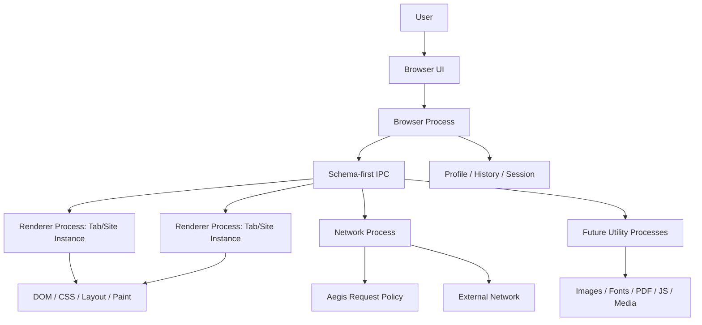
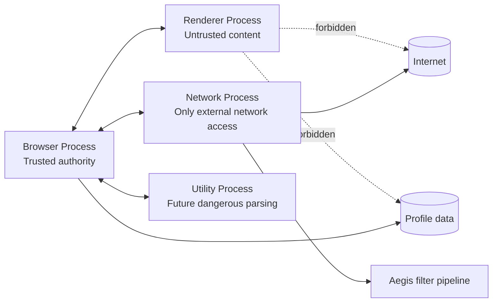

# Speed Project State

Version: v0.1 MVP static browsing path
Last updated: 2026-06-07  
Status: static HTTP/HTTPS browsing path, Aegis block path, engine render pipeline, console shell,
and durable history foundation implemented / CMake build and tests passing

## 1. What Speed is

Speed is a new open-source browser written primarily in C++23 with its own browser engine. The project is intentionally designed for long-term growth into a large Chromium-scale repository, but the v0.1 target is a narrow MVP: static web browsing, basic HTML/CSS parsing and rendering, tabs, history, basic Aegis ad/tracker blocking, and the foundation of a multi-process architecture.

Speed's core idea is:

> Memory is fuel. Speed may spend more memory to obtain speed, safety, recovery, and comfort, but memory spending must be observable, bounded by policy, and reclaimable under pressure.

## 2. Non-negotiable project constraints

These are fixed unless the project is intentionally restarted with a new constitution.

- Primary implementation language: C++23.
- Renderer processes are untrusted.
- The Network Process is the only process allowed to perform external network communication.
- The Browser Process is the center of authority for permissions, process ownership, navigation decisions, profile state, and recovery coordination.
- Dangerous or complex subsystems such as crypto, certificate validation, image decoding, font parsing, PDF, JavaScript, and media must be separable into Utility Processes or trusted third-party library boundaries.
- IPC must be schema-first and compatible with future IDL-based C++ code generation. Ad-hoc handwritten message protocols are forbidden.
- Aegis, the ad/tracker defense subsystem, is a first-class architecture module from day one.
- WPT, fuzzing, unit tests, layout tests, and integration tests must be possible without repository restructuring.
- The repository must be readable, approachable, and contribution-friendly as OSS.

## 3. Current phase

Current phase: **Implementation Skeleton v0.1**

The goal of this phase is to turn the architecture backbone into a buildable, testable repository skeleton while keeping all process, IPC, module, and MVP boundaries intact.

## 4. v0.1 MVP scope

v0.1 includes:

- A minimal Browser Process.
- A minimal Renderer Process.
- A minimal Network Process.
- A minimal IPC schema and transport.
- Basic tab model.
- Basic navigation from URL to document load.
- Static HTML parsing sufficient for simple pages.
- Basic CSS parsing and cascade for a small property subset.
- Basic DOM tree.
- Basic style, layout, paint pipeline.
- A simple CPU-backed rendering path.
- Basic history.
- Basic profile directory abstraction.
- Aegis v0.1 request blocking with static block lists.
- Unit test skeletons and future test directory layout.

v0.1 excludes:

- Full JavaScript support.
- WebAssembly.
- Video/audio/media pipeline.
- Full CSS compatibility.
- Full HTML parser compatibility.
- Extension APIs.
- DevTools complete implementation.
- Service Workers.
- WebRTC.
- PDF viewer.
- Full GPU compositor.
- Browser sync.
- Password manager.
- Complete accessibility implementation.

## 5. Decision priority order

When design goals conflict, resolve in this order:

1. User safety and security boundaries.
2. Process isolation and privilege minimization.
3. Recovery and data integrity.
4. Architecture Constitution and Forbidden Designs.
5. MVP scope discipline.
6. Dependency direction rules.
7. Testability and observability.
8. Performance and responsiveness.
9. Memory-as-fuel optimizations.
10. Developer convenience.

Memory may be spent for speed, safety, recovery, or comfort, but never to bypass security, process isolation, observability, or recovery constraints.

## 6. Must-read files by task type

| Task type                           | Read these first                                                                |
| ----------------------------------- | ------------------------------------------------------------------------------- |
| Any implementation task             | `PROJECT_STATE.md`, `ARCHITECTURE_CONSTITUTION.md`, `DECISION_BACKBONE.md`      |
| MVP scope question                  | `MVP_SCOPE.md`, `ROADMAP.md`, `DEFERRED_DECISIONS.md`                           |
| Process, IPC, privilege, sandboxing | `PROCESS_MODEL.md`, `SECURITY_MODEL.md`, `DEPENDENCY_RULES.md`                  |
| Module placement                    | `MODULE_BOUNDARIES.md`, `DEPENDENCY_RULES.md`, `REPOSITORY_STRUCTURE.md`        |
| Aegis work                          | `MODULE_BOUNDARIES.md`, `SECURITY_MODEL.md`, `PROCESS_MODEL.md`, `MVP_SCOPE.md` |
| New architectural decision          | `DECISION_BACKBONE.md`, `ADR_TEMPLATE.md`, `CODEX_IMPLEMENTATION_PROTOCOL.md`   |
| Refactor                            | `ARCHITECTURE_CONSTITUTION.md`, `DEPENDENCY_RULES.md`, `FORBIDDEN_DESIGNS.md`   |
| Test infrastructure                 | `MVP_SCOPE.md`, `REPOSITORY_STRUCTURE.md`, `CODEX_IMPLEMENTATION_PROTOCOL.md`   |
| Forgotten context recovery          | Read this file completely, then `ROADMAP.md` and latest ADRs                    |

## 7. Current architecture snapshot

## 8. Current process model snapshot

## 9. Active strong defaults

- Start with a simple cross-platform platform abstraction rather than binding engine internals to a single GUI toolkit.
- v0.1 Renderer isolation is at least per tab; future site/origin isolation must remain possible.
- v0.1 rendering can be CPU-backed; GPU compositor is deferred.
- Use existing battle-tested libraries for TLS/certificate validation and other dangerous huge domains through narrow wrapper interfaces.
- Define IPC messages in schema files before writing C++ handlers.
- Maintain strict `src/` module boundaries from the first commit.
- Use small, boring, reviewable C++ instead of clever template-heavy frameworks.

## 10. Active forbidden designs

- Renderer performs external network access.
- Renderer is treated as trusted.
- Renderer directly reads/writes profile, history, cookies, permissions, or filesystem outside explicit brokered APIs.
- Ad-hoc IPC messages without schema ownership.
- Network requests bypass Aegis policy hooks.
- Long-term monolithic browser executable containing UI, network, renderer, storage, and parser all with equal privilege.
- Global mutable state shared across major modules.
- Introducing a dependency cycle to finish a feature quickly.
- Adding a feature to v0.1 merely because it is interesting.
- Unbounded caches without memory pressure and instrumentation plans.

## 11. ADR rules

Create an ADR when a change:

- Alters a Fixed decision.
- Changes a Strong Default.
- Introduces a new process, privilege boundary, storage authority, or IPC category.
- Adds a third-party dependency outside already approved dependency classes.
- Expands v0.1 scope.
- Reclassifies a Deferred or Experimental decision.
- Changes module dependency direction.
- Adds a long-lived public API.

Do not create an ADR for ordinary implementation details that remain inside an existing module boundary and follow all defaults.

## 12. Immediate next implementation sequence

Completed skeleton setup:

1. Repository skeleton and docs.
2. CMake build system skeleton.
3. Process entrypoint skeletons for Browser, Renderer, Network, and Utility.
4. IPC schema directory and minimal manual runtime registry.
5. Initial module targets for Base, IPC, Platform, Aegis, Storage, Engine, UI, Network, Renderer, Browser, and Utility.
6. Initial unit/integration test hooks through CTest.
7. Formatting and static-analysis foundation: Allman clang-format, scoped clang-tidy, Prettier, npm scripts, and CMake presets.
8. Strict compiler warning foundation with warnings-as-errors enabled for Speed-owned targets.

Completed post-skeleton progress:

1. Browser Process lifecycle and expanded in-memory tab model.
2. Network Process request service stub with the Aegis hook in the real request path.
3. Renderer Process document load stub.
4. First HTML tokenizer/tree-building subset for static document fragments.
5. Navigation IPC document payload contract clarified from `body_ref` to `document_body`.
6. Network fetch adapter boundary added with Aegis-before-dispatch enforcement, simple HTTP static
   body fetch, and OpenSSL-backed HTTPS fetch.
7. Renderer commit pipeline extended through HTML parse, CSS/style resolve, layout, and CPU
   display-list paint output.
8. Console BrowserShell added for URL navigation, tab create/switch/close/list, history display,
   page/error display, CLI URL smoke mode, and quit.
9. Browser-owned durable history file foundation added behind `ProfileDirectory`.
10. Simulated renderer crash handling transitions the affected tab to crashed state without
    terminating the Browser Process.

Recommended next milestone sequence:

1. Replace in-process app wiring with real process launch, IPC transport, supervision, and recovery
   while preserving the existing schema-first contracts.
2. Add CI once local build and test flow stabilizes.

## 13. Recovery procedure when context is forgotten

1. Read this file completely.
2. Read `ARCHITECTURE_CONSTITUTION.md` sections 1-7.
3. Read `DECISION_BACKBONE.md` classification table.
4. Read `MVP_SCOPE.md` to avoid scope creep.
5. Read `FORBIDDEN_DESIGNS.md` before modifying process, IPC, storage, or network code.
6. Read the latest accepted ADRs in `docs/adr/` when that directory exists.
7. Inspect current open GitHub issues and current branch diff.
8. Continue only after identifying which module owns the task and which decision class applies.
